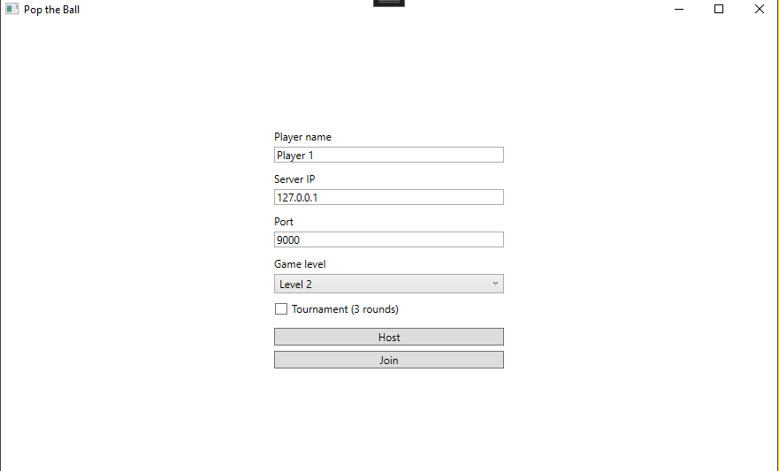
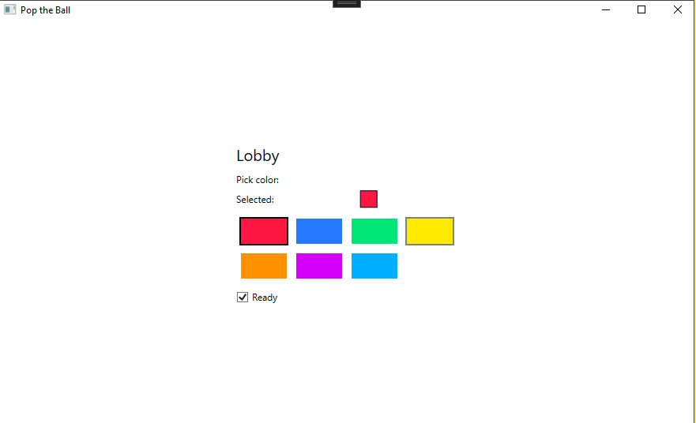
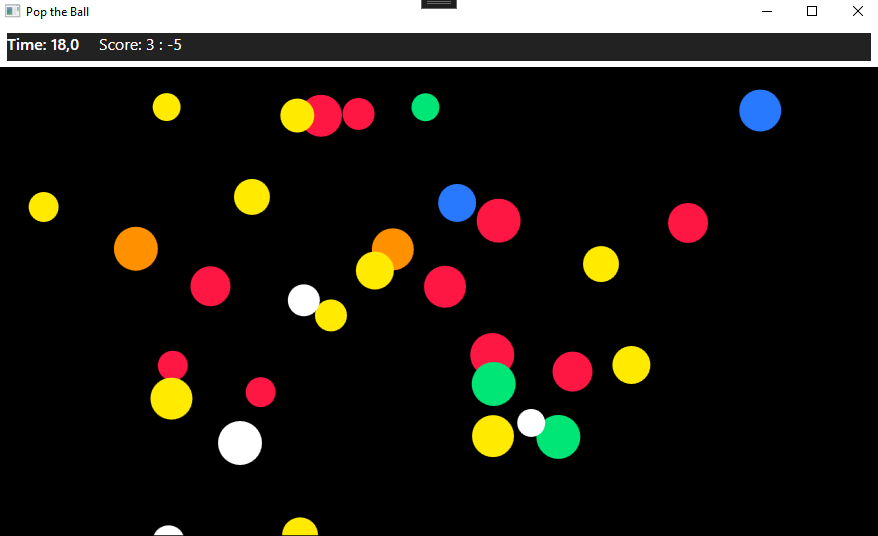
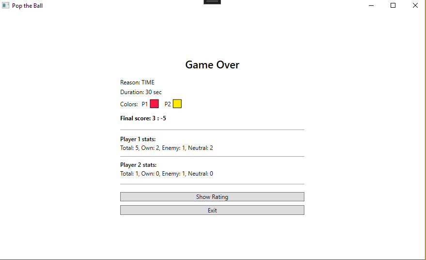
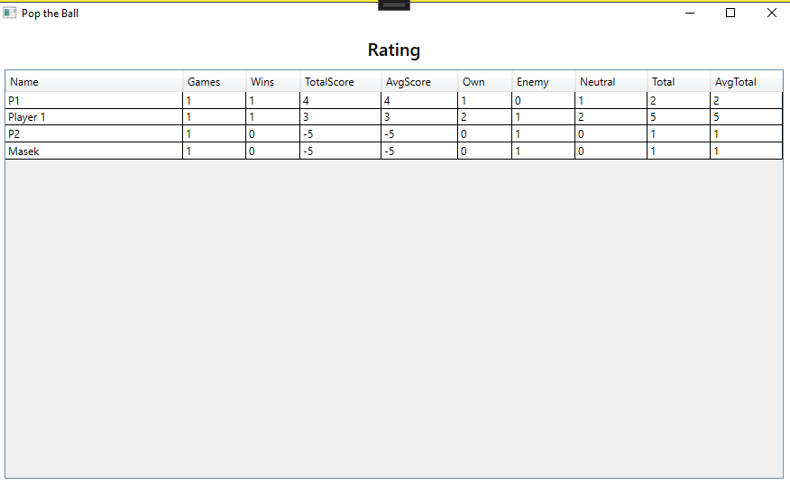

# Client-Server TCP Game

## Overview
A desktop multiplayer game built with C#, WPF, and TCP sockets. The project demonstrates networking, state synchronization, and basic data persistence in a desktop environment.

The application uses TCP sockets and JSON-based message exchange to synchronize gameplay between players. It supports hosting and joining to multiplayer sessions, real-time interaction, and persistent rating storage.

## Features
- Client-server multiplayer architecture
- TCP communication between server and clients
- JSON-based message exchange
- Lobby with player connection and ready state
- Player color selection
- Real-time gameplay synchronization
- Score calculation and result screen
- Persistent rating system 

## Tech Stack
- C#
- .NET / WPF
- TCP sockets
- JSON serialization
- SQLite
  
## Architecture
The application follows a client-server model:

- **Server (Host)** — manages game sessions and shared state  
- **Client**        — connects to the server and participates in gameplay  
- **Shared layer**  — common models and message contracts  
- **Network layer** — TCP communication handling  
- **Data layer**    — stores match results and rating data  
  
## How to Run

### From source
1. Open `ClientServerTcpGame.sln` in Visual Studio  
2. Build the solution  
3. Run the application  
### Prebuilt version
1. Download the latest release from the **Releases** section  
2. Extract the archive  
3. Run `ClientServerTcpGame.exe`

## How to Play (Multiplayer Setup)

To play the game, both players must be connected to the **same local network**.

### Network setup
- Players can:
  - use the same Wi-Fi network  
  - or use tools like **Hamachi** to simulate a shared network  

### Connection steps
1. Ensure both players are in the same network  
2. Both players enter the same IP address (the IP of one of the players)
3. Start the application on both machines
4. One player selects **Host** to start the server 
5. The other player selects **Join** to connect

### Game Flow
1. One player selects **Host (Server)**  
   - can choose level and enable tournament mode  

2. The second player selects **Join**  
   - connects to the session  

3. After connection:
   - both players select their **color**
   - both click **Ready**

4. When both players are ready the game starts  

## Core Functionality
- Client connection and reconnection
- Lobby synchronization
- Ready-state management
- Unique player color assignment
- Real-time score updates
- Disconnect handling
- Rating calculation and storage

## Data Storage
The application uses a local SQLite database to store:
- match history  
- player statistics  
- tournament data  

This enables rating calculation and persistence across sessions.

---

## QA Documentation

This project includes manual QA documentation for testing the C# WPF TCP client-server game.

### QA Artifacts

- [Test Plan](QA/test_plan.md)
- [Test Cases](QA/test_cases.md)
- [Bug Reports](QA/bug_reports.md)
- [Test Run Report](QA/test_run_report.md)

### Testing Summary

Manual testing covered:

- Host and join flow
- Color selection
- Ready-state behavior
- Game start logic
- Timer-based game ending
- Disconnect handling
- Post-game score display
- Rating update and persistence
- Negative connection scenarios

### Test Results

| Result | Count |
|---|---:|
| Passed | 14 |
| Failed | 4 |
| Open Bugs | 4 |

### Main Findings

The main two-player flow works successfully. Players can join a host session, reach color selection, start the game, finish by timer, view scores, show rating, and keep rating data after restart.

The main issues found are related to invalid connection handling and host disconnect behavior.

## Screenshots

